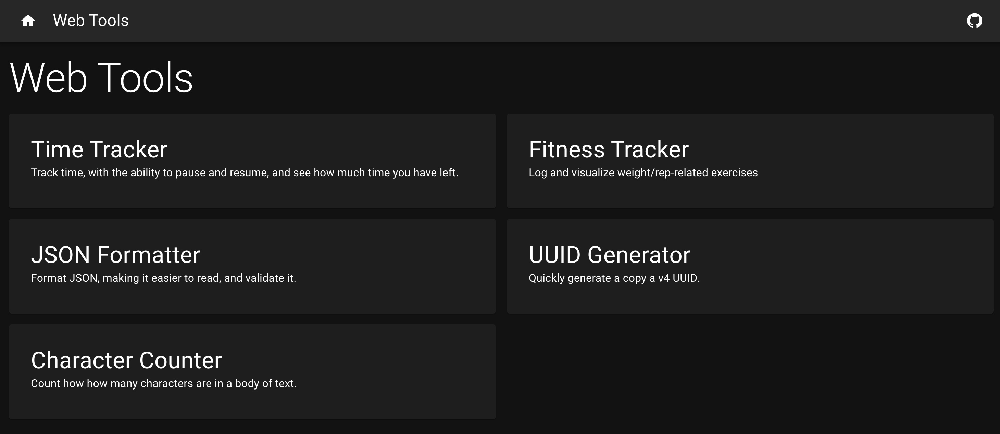

# web-tools

A set of productivity tools that run in your browser. No data collection; no logins. Everything is powered by Local Storage and IndexedDB.

Use the tools at https://epeters3.github.io/web-tools/

